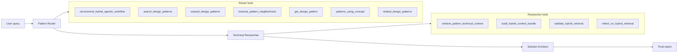

# Architecture

This document explains how the Hybrid RAG Agentic Workflow is structured, how data flows at runtime, and how this repository maps to Cloudera AI Agent Studio concepts.

## High-level overview

```text
┌─────────────────────────────────────────────────────────────────┐
│  GitHub repo (this project)                                     │
│  workflow.yaml + collated_input.json + studio-data/             │
└────────────────────────────┬────────────────────────────────────┘
                             │ Agent Studio GitHub deploy
                             ▼
┌─────────────────────────────────────────────────────────────────┐
│  Cloudera AI Agent Studio                                       │
│  Clone → package artifact.tar.gz → build tool venvs → deploy    │
└────────────────────────────┬────────────────────────────────────┘
                             │
                             ▼
┌─────────────────────────────────────────────────────────────────┐
│  CML Model + Application (workbench_model deployment target)    │
│  3 sequential CrewAI-style agents + 11 Python tool venvs        │
└────────────────────────────┬────────────────────────────────────┘
                             │ kickoff {"query": "..."}
                             ▼
┌─────────────────────────────────────────────────────────────────┐
│  Hybrid RAG pipeline                                            │
│  graph.json routing → slice markdown retrieval → LLM synthesis  │
└─────────────────────────────────────────────────────────────────┘
```

## Design philosophy

The workflow implements a **two-layer hybrid RAG** pattern from the book *Generative AI Design Patterns*:

1. **Structured layer** — `graph.json` knowledge graph (32 design patterns, concepts, edges).
2. **Text layer** — book slice markdown (`pages_*.md`) with section-aware excerpt extraction.

Agents do not call an external vector database at runtime. All retrieval is **deterministic** over files shipped in the deploy artifact.

This differs from generic ChromaDB/GraphRAG tutorials referenced in the book's illustrative examples. The Solution Architect agent is explicitly prompted to recommend *this* stack, not generic demos.

## CollatedInput artifact

Agent Studio custom workflows use **CollatedInput** — a single JSON document describing the entire workflow.

| CollatedInput section | Purpose |
|-----------------------|---------|
| `workflow` | Name, description, sequential/hierarchical process, agent/task ID ordering |
| `language_models` | LLM provider entries referenced by agents |
| `agents` | Role, goal, backstory, temperature, assigned tool IDs |
| `tasks` | Description (with `{query}` placeholders), expected output, assigned agent |
| `tool_instances` | Pointer to `studio-data/.../tools/<name>/tool.py` + metadata |

The manifest file `workflow.yaml` declares:

```yaml
type: collated_input
input: collated_input.json
```

## Agent pipeline (sequential)



### Agent 1: Pattern Router

**Goal:** Identify relevant design patterns from the knowledge graph.

Uses graph navigation tools to produce a **routing plan**: primary patterns, expanded patterns, neighborhood traversal, and the canonical agentic workflow stack.

### Agent 2: Technical Researcher

**Goal:** Extract book-grounded implementation details for every routed pattern.

Calls slice retrieval tools, then runs Self-RAG-style validation/reflection gates (Patterns 13, 12).

### Agent 3: Solution Architect

**Goal:** Synthesize routing plan + technical dossier into a production-ready architecture report.

No tools — pure LLM synthesis over prior task outputs.

## Bundled data

### Knowledge graph (`data/graph.json`)

- **32** `DesignPattern` nodes (pattern numbers 1–32)
- **241** `Concept` nodes
- **561** edges (primarily `USES_CONCEPT`)
- Pattern fields used at runtime: `name`, `problem`, `solution`, `when_to_use`, `tradeoffs`, `implementation_notes`, `related_patterns`

### Book slices (`data/slices/pages_*.md`)

- **14** markdown files covering book pages 001–694
- Section-aware parsing locates `Pattern N:` headings and extracts overview, problem, solution, implementation, caveats, and code blocks

**Important:** The full corpus is committed in this repo. Deploy does **not** fetch external data.

## Shared toolkit (`lib/`)

| Module | Role |
|--------|------|
| `hybrid_rag.py` | `HybridRAGToolkit`, graph index, slice parsing, hybrid context bundle, validation/reflection |
| `paths.py` | Resolve `data/graph.json` and `data/slices` relative to tool/workflow root |
| `tool_runtime.py` | `build_toolkit()` helper used by every tool entrypoint |

**Source of truth:** `converters/hybrid_rag_lib/` — copied into `studio-data/.../lib/` by `bundle_hybrid_data.py`.

## Tool execution model

Each tool is a standalone Python script:

```text
studio-data/workflows/hybrid_rag_agentic/tools/<tool_name>/
├── tool.py           # UserParameters + ToolParameters (Pydantic) + run_tool()
└── requirements.txt  # pydantic>=2.0.0
```

Agent Studio builds a **per-tool virtualenv** at deploy time. Tools are invoked via subprocess with JSON `--user-params` and `--tool-params`.

Standard tool pattern:

```python
def run_tool(config: UserParameters, args: ToolParameters) -> str:
    toolkit = build_toolkit(config, _TOOL_FILE)
    return toolkit.some_method(...)
```

Tools return JSON strings (compact) consumed by agents as tool output.

## Hybrid context pipeline (deterministic)

Used by `build_hybrid_context_bundle`, `expand_design_patterns`, `validate_hybrid_retrieval`, and `reflect_on_hybrid_retrieval`:

1. **Route** — search graph for query-matching patterns (RAG shortcut if query contains "rag").
2. **Collect evidence** — retrieve top-k pattern technical sections from slices.
3. **Expand** — add patterns from excerpt cross-refs, production/safety heuristics, graph neighbors.
4. **Fuse & rerank** — score by query-term overlap, code-block presence (Pattern 10 postprocessing).
5. **Validate** — check pattern count, code blocks, graph+text coverage.
6. **Reflect** — Self-RAG decision: `sufficient` vs `expand`.

## Deploy architecture

Deploy payload (`deploy/deployment-config.example.json`):

| Field | Value |
|-------|-------|
| `workflow_target.type` | `github` |
| `workflow_target.github_url` | This repository URL |
| `workflow_target.workflow_name` | Must match `collated_input.json` → `workflow.name` |
| `deployment_target.type` | `workbench_model` |
| `deployment_config.llm_config` | Injected by `deploy.py` from `OPENAI_API_KEY` |

Deploy API: `POST /api/grpc/deployWorkflow` on Agent Studio.

Agent Studio:

1. Clones GitHub repo
2. Packages root files into `artifact.tar.gz`
3. Builds tool venvs
4. Creates/updates CML Model + Application

## GitHub deploy vs UI builder

| Aspect | GitHub deploy (this repo) | Agent Studio UI builder |
|--------|---------------------------|-------------------------|
| Source of truth | Git | Agent Studio database |
| Edit workflow | Edit JSON + push | Visual editor |
| Post-deploy editing | GitOps redeploy only | In UI |
| Template import | CollatedInput (deploy) | `workflow_template.json` zip (different format) |

## CrewAI migration lineage

This project was bootstrapped from CrewAI `crew_hybrid`:

| Phase | Deliverable |
|-------|-------------|
| Phase 0 | `crewai_to_collated.py` — YAML → CollatedInput skeleton |
| Phase 1 | Bundle corpus + 2 core tools |
| Phase 2 | All 11 tools + full `HybridRAGToolkit` |

The CrewAI `@tool` wrappers in the upstream project map 1:1 to Agent Studio tool folders. Logic lives in `HybridRAGToolkit`; tools are thin adapters.

## Extension points

| Change | Where to edit |
|--------|---------------|
| Retrieval logic | `converters/hybrid_rag_lib/hybrid_rag.py` |
| New tool | Add toolkit method + `TOOL_SPECS` entry + regenerate bundle |
| Agent prompts | `collated_input.json` |
| Agent/tool assignment | `collated_input.json` or `converters/crew_specs/*.yaml` |
| LLM model | `collated_input.json` `language_models` + Agent Studio registration |
| Corpus update | Upstream graph merge → `bundle_hybrid_data.py --source` |
| Optional quality evaluator | Not yet ported — would add 4th agent in CollatedInput |

## Security model

- **Deploy-time secrets:** OpenAI key via `llm_config`; CML API key for API calls.
- **Agent Studio internal key:** Separate CML key for deploy engine (`cmlApiCheck` / `rotateCmlApi`).
- **Tool user params:** Currently empty — tools need no API keys (local file retrieval only).
- **No network calls in tools** — graph + slices are local files in the artifact.
